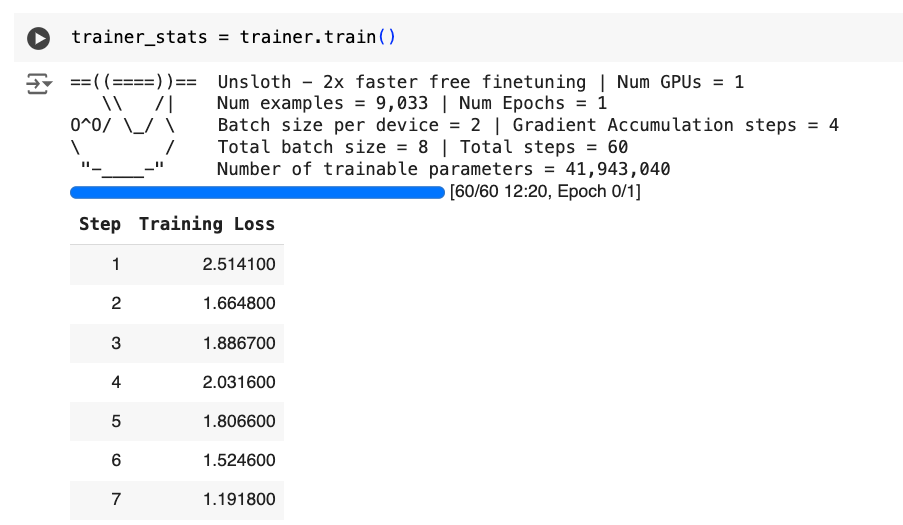

# 🧉 milei-gpt

Che y si queremos hacer un LLM que hable de la misma forma que un famoso ... **como hacemos?**

Este repo es una excusa para aprender a preparar un dataset para fine-tunear algún LLM, aprender como evaluarlo, como tokenizarlo, como extenderlo de formar sintética, y tantas otras cosas. Al final, si todo sale bien, vamos a tener un modelo que va a hablar como la persona que elegimos, y le podemos poner un RAG (retrieval augmented generation) encima para que nos traiga un contexto correcto y factual en las respuestas. Por ahora, la idea es hacerlo sobre Llama3-8B y usando APIs públicas para procesar la data, sobre mas de 100 horas de entrevistas.

> [!IMPORTANT]
> - 📚 **dataset –** https://huggingface.co/datasets/machinelearnear/multiturn_chat_milei_gpt
> - 🚀 **modelo -** https://huggingface.co/machinelearnear/llama-3-8b-milei-gpt
> - Si querés probar como funciona, podés seguir los pasos [de esta notebook](./notebooks/llama-3-8b-unsloth-chat-template-inference.ipynb)

## Paso a paso, que vamos a hacer
- [X] Encontrar todas las entrevistas en YT de algún famoso/a y ponerlas en un `.csv`
- [X] Transcribir las entrevistas e identificar a los speakers (+ verificación)
- [X] Preparar un dataset (convertir a `ChatML`, tokenization, mergear speakers, etc.)
- [X] Elegir un modelo base eg. `Llama3-8B` o `Phi-3-mini-128k-instruct`.
- [X] Fine-tuning del LLM, evaluación/inferencia, y pushearlo a Huggingface.
- [ ] Procesar el dataset con un LLM para mejorar las conversaciones.
- [ ] Armar un RAG indexando las entrevistas y meterle este LLM encima.

## Links para ir leyendo y tener en cuenta
- https://www.philschmid.de/fine-tune-llms-in-2024-with-trl
- https://github.com/huggingface/alignment-handbook
- https://github.com/unslothai/unsloth
- https://predibase.com/blog/lora-land-fine-tuned-open-source-llms-that-outperform-gpt-4
- https://medium.com/@xuebinbin12/fine-tuning-chat-based-llm-with-multi-turn-conversational-data-part-i-d8c64d01a20d
- https://github.com/e-p-armstrong/augmentoolkit, https://github.com/severian42/Vodalus-Expert-LLM-Forge, https://huggingface.co/blog/dvilasuero/synthetic-data-with-llama3-distilabel
- https://huggingface.co/docs/transformers/main/en/chat_templating
- https://huggingface.co/blog/burtenshaw/domain-specific-datasets
- https://huggingface.co/spaces/argilla/domain-specific-datasets-welcome
- https://www.reddit.com/r/LocalLLaMA/

## 🛠 Buenos, vamos a arrancar, que necesitás?

- Una GPU con >= 8GB de VRAM (local o [Google Colab](https://colab.research.google.com/), [Sagemaker StudioLab](https://studiolab.sagemaker.aws/), o algo como [LightingAI](https://lightning.ai/)).
- `Python>=3.10`
- `yt-dlp` para bajarse los videos de YT
- `whisperX` para transcribir el audio.
- `pyannote-audio` para reconocer las voces y diferenciar a los hablantes.
- `NVIDIA NeMo` para diarización de audio.

### Cloná el repo y armá el environment

```bash
$ git clone https://github.com/machinelearnear/milei-gpt
$ cd milei-gpt
```

Armá todo directando con el `environment.yml` o sino instalá las librerias con `pip install -r requirements.txt`.

```
$ conda env create -f environment.yml
$ conda activate machinelearnear-dev
```

### Vamos a ver el código un poco
Como todo esto es un WIP (work in progress) lo tengo todo puesto adentro de `./scripts`. Vamos a ver algunos: 

**`0_encontrar_raw_data_en_youtube.py`**

Este script se utiliza para extraer información de videos de YouTube de ciertos candidatos, procesar esa información para obtener detalles específicos sobre los videos (como duración, vistas, etc.), y luego filtrar y guardar los datos en `./data/dataset.csv`. Además, el script organiza los datos tanto de videos de alta calidad (HQ) como de baja calidad (LQ) para su posterior uso.

```
python 0_encontrar_raw_data_en_youtube.py --data_dir_hq ./data/youtube_data_hq \
    --data_dir_lq ./data/youtube_data_lq --output_filename ./data/dataset.csv
```

**`1_whisper_transcription_nemo_diarization.py`**


El script descarga audios de YouTube que teniamos guardados en `./data/dataset.csv`, realiza transcripciones utilizando Whisper y realiza la diarización de los segmentos de audio para identificar y separar las diferentes voces en el audio usando NeMo. Estoy usando una versión modificada de este repo: [whisper-diarization](https://github.com/MahmoudAshraf97/whisper-diarization). Finalmente, guarda los resultados en archivos JSON en `./output/{target_speaker_name}/{youtube_video_id}.json`.

Esta es la estructura de los JSON que vamos a tener de output, eg. `./output/milei/ad5K-6f8dqs.json`, pueden ver las conversaciones mergeadas dentro de los segmentos (varias por el mismo speaker).

**Top-level keys:** These are metadata fields providing information about the video.

- `Index` An integer index.
- `channel_id` The ID of the YouTube channel.
- `channel` The name of the channel.
- `uploader_url` The URL of the uploader's YouTube page.
- `id` The ID of the video.
- `url` The URL of the video.
- `title` The title of the video.
- `duration` The duration of the video in seconds.
- `view_count` The view count of the video.
- `candidate_name` The name of the candidate.
- `quality` The quality of the video.

**Segments:** An array of dictionaries, each representing a segment of the video with the following keys:

- `speaker` The speaker of the segment.
- `start_time` The start time of the segment in seconds.
- `end_time` The end time of the segment in seconds.
- `text` The text spoken during the segment.
- `cosine_dist` The cosine distance value (probably used for speaker verification).
- `is_target_speaker` A boolean indicating if the speaker is the target speaker.

```json
{
    "Index": 67,
    "channel_id": "UCz489cQmrgH57sShDiatwfw",
    "channel": "El Peluca Milei",
    "uploader_url": "https://www.youtube.com/@ElPelucaMilei",
    "id": "ad5K-6f8dqs",
    "url": "https://www.youtube.com/watch?v=ad5K-6f8dqs",
    "title": "LA ÚLTIMA ENTREVISTA DE MILEI ANTES DE SER PRESIDENTE",
    "duration": 1149.0,
    "view_count": 1206055,
    "candidate_name": "milei",
    "quality": "high",
    "segments": [
        {
            "speaker": "Speaker 1",
            "start_time": 0.62,
            "end_time": 50.614,
            "text": "¿Seguís el dólar?  No.  Balotage.  ¿Te imaginás en él?  Y probamos a ser todos más pobres.  Tengo una consulta sencilla.  En el país de mi ley, yo voy, compro un arma, ¿la puedo llevar?  Es falso.  Nunca dijiste, no se cometieron delitos de lesa humanidad.  ¿Es que hay corrupción en el INCUCAI?  En Argentina hay como un consenso de que tengas la guita que tengas, tenés que ir a una lista.  ¿Realmente creés que hay corrupción?  Tenés cara de... Te vas a sorprender.  el domingo.  Fue el más votado en las PASO y es el que hizo las propuestas más disruptivas en la campaña.  Algunas realmente polémicas.  Le pedimos en el Movistar Arena, a minutos del cierre de campaña, quince minutos a solas, su camarín.  A Javier Milei.  Javier. ",
            "cosine_dist": 0.7135412962560479,
            "is_target_speaker": false
        },
        {
            "speaker": "Speaker 0",
            "start_time": 51.214,
            "end_time": 52.235,
            "text": "¿Qué tal, Rodolfo? ",
            "cosine_dist": 0.8585994301094911,
            "is_target_speaker": false
        },
        {
            "speaker": "Speaker 1",
            "start_time": 52.275,
            "end_time": 53.756,
            "text": "Gracias por recibirnos. ",
            "cosine_dist": 0.8117557859327827,
            "is_target_speaker": false
        },
        ...
    ]
}
```

Y asi lo ejecutamos

```
python b_whisper_transcription_nemo_diarization.py --hf_token TU_HF_TOKEN \
    --input_file ./data/dataset.csv --ref_audio_dir ./data/reference_audio --output_dir ./output
```

Aca tienen los pasos donde se hace mas o menos todo:

```python
def main():
    parser = argparse.ArgumentParser(description='transcribe & diarize speech segments')
    ...
    if os.path.exists(f'{output_dir}/{each.candidate_name}/{each.id}.json'):
        logger.info(f'File already exists!')
        continue

    # start audio pipeline
    io = Audio(sample_rate=16000, mono="downmix")
    ref_audio_filename = f'{ref_audio_dir}/audio_{each.candidate_name}.wav'
    reference_segment = Segment(1., 10.)
    reference_embeddings = inference_pipeline.crop(ref_audio_filename, reference_segment)

    try:
        download_audio(each.url, temp_dir)
    except Exception as e:
        logger.error(f"Failed to download audio for: {each.url}. Error: {e}")
        continue

    is_main_speaker, appearance_time_from_main_speaker = check_if_main_speaker_or_not(io, inference_pipeline, reference_embeddings, audio_path, cdist_threshold, embedding_model, min_appearance_time)
    ...
    if not is_main_speaker:
        logger.info(f'Speaker "{each.candidate_name}" was not found')
        shutil.rmtree(temp_dir)
        continue
    ...
    msdd_model = NeuralDiarizer(cfg=create_config(temp_path)).to("cuda")
    msdd_model.diarize()
    del msdd_model
    torch.cuda.empty_cache()

    speaker_ts = []
    with open(os.path.join(temp_path, "pred_rttms", "mono_file.rttm"), "r") as f:
        lines = f.readlines()
        ...
    wsm = get_words_speaker_mapping(word_timestamps, speaker_ts, "start")

    if language in punct_model_langs:
        punct_model = PunctuationModel(model="kredor/punctuate-all")
        words_list = list(map(lambda x: x["word"], wsm))
        labled_words = punct_model.predict(words_list)
        ...
        for word_dict, labeled_tuple in zip(wsm, labled_words):
            word = word_dict["word"]
            ...
            word_dict["word"] = word
    else:
        logger.warning(f"Punctuation restoration is not available for {language} language. Using the original punctuation.")

    wsm = get_realigned_ws_mapping_with_punctuation(wsm)
    ssm = get_sentences_speaker_mapping(wsm, speaker_ts)
    logger.info(f'Finished transcription with Whisper')
    waveform_target, sample_rate_target = torchaudio.load(audio_path)
    wav_duration = waveform_target.shape[1] / sample_rate_target

    logger.info(f'Speaker verification for each audio segment...')
    merged_segments = merge_segments(ssm)

    for chunk in merged_segments:
        start_time = chunk['start_time'] / 1000.0
        end_time = chunk['end_time'] / 1000.0
        ...
        if (end_time - start_time) <= 0.6:
            chunk['cosine_dist'] = 1.0
            chunk['is_target_speaker'] = False
            continue

        segment_chunk = Segment(start_time, end_time)
        waveform_chunk, sample_rate = io.crop(audio_path, segment_chunk)
        chunk_embeddings = inference_pipeline({"waveform": waveform_chunk, "sample_rate": sample_rate})
        distance = cdist(np.reshape(reference_embeddings, (1, -1)), np.reshape(chunk_embeddings, (1, -1)), metric="cosine")
        chunk['start_time'] = start_time
        chunk['end_time'] = end_time
        chunk['cosine_dist'] = float(distance[0][0])
        chunk['is_target_speaker'] = bool(distance[0][0] <= cdist_threshold)

    logger.info(f'Finished! ...')
    save_dict_to_file(merged_segments, each, each.candidate_name, output_dir, filename=each.id)
    cleanup(temp_path)

```

**`create-multiturn-conv-dataset.ipynb`**

Ya hicimos las transcripciones, ya detectamos los speakers (y le pusimos "Speaker 0" o "Speaker 1", etc.), y ya mergeamos también muchos de los segmentos (cortos) para hacer oraciones mas largas asignadas a cada speaker. Lo último lo hacemos porque, especialmente en entrevistas, se puede dar que alguién hable por encima de otro y esto hace que la diarization salga mal, también jode muchisimo el tema de calcular los embeddings y después verificar si es o no el target speaker. [Ver ejemplo de los Simpsons](https://www.youtube.com/watch?v=_JgmDgztqhg&ab_channel=JackER). Con lo que nos encontramos al final de todo es que quizás en una misma entrevista tenemos 5 speakers distintos (le hardcodee `max_num_speakers=5` en una parte) y quizás la misma persona va cambiando de Speaker ID. Para arreglar esto es que hago lo de los embeddings sobre cada segmento de audio donde se detecto un speaker versus un audio de referencia (lo encuentran en `./data/reference_audio/{target_speaker}_audio.wav`). Esto igual no anda muy bien para segmentos cortos (menos de ~5 segundos). Por eso lo que terminé haciendo es calcular la mediana y el promedio de la distancia de coseno (`cosine_dist`) y cuantas veces apareció (`num_ocurrences`) para cada speaker.

Por ejemplo, si corres esta función
```python
def calculate_speaker_stats(data, filter_length=50):
    speakers_cosine_dist = {}
    segments = data if isinstance(data, list) else data.get('segments', [])

    for segment in segments:
        if 'speaker' not in segment:
            continue
        
        speaker = segment['speaker']
        text_length = len(segment['text'])
        cosine_dist = segment['cosine_dist']
        
        if text_length > filter_length:
            if speaker not in speakers_cosine_dist:
                speakers_cosine_dist[speaker] = []
            speakers_cosine_dist[speaker].append(cosine_dist)

    speaker_stats = {}
    for speaker, cosine_dists in speakers_cosine_dist.items():
        median_cosine_dist = np.median(cosine_dists)
        average_cosine_dist = np.mean(cosine_dists)
        occurrences = len(cosine_dists)
        speaker_stats[speaker] = {
            'median_cosine_dist': median_cosine_dist,
            'average_cosine_dist': average_cosine_dist,
            'occurrences': occurrences
        }
    
    return speaker_stats
```

Lo que te da es esto, donde se ve claramente que "Speaker 0" es nuestro `{target_speaker}`.
```python
{'Speaker 4': {'median_cosine_dist': 0.8512727040005762,
  'average_cosine_dist': 0.8256600425759245,
  'occurrences': 6},
 'Speaker 1': {'median_cosine_dist': 0.7133732929455995,
  'average_cosine_dist': 0.7323134669991489,
  'occurrences': 38},
 'Speaker 0': {'median_cosine_dist': 0.4919720382693402,
  'average_cosine_dist': 0.5008547772762606,
  'occurrences': 35},
 'Speaker 2': {'median_cosine_dist': 1.0013322822014143,
  'average_cosine_dist': 0.9767822612662288,
  'occurrences': 3},
 'Speaker 3': {'median_cosine_dist': 0.954972954025414,
  'average_cosine_dist': 0.954972954025414,
  'occurrences': 1}}
```

Después hago unas validaciones para tener siempre al menos 2 speakers, y que la cantidad de ocurrencias sea mayor a 30, esto es para evitar un discurso/monólogo. Acuérdense que lo que queremos hacer es tener una multi-turn conversation, ida y vuelta, los discursos los podemos tomar para hacer conversaciones sintéticas pero por ahora no lo necesitamos. Aproximadamente esto nos deja un ~80% del dataset original. Seguimos procesando todo y nos queda un pandas dataframe con una fila por cada entrevista con una columna que se llama `messages` que se ve así. Recuerden que en este caso `user` seria la persona que hace las preguntas (o nosotros cuando lo usemos) y `assistant` es la AI que vamos a entrenar (o nuestro `{target_speaker}` que estamos personificando).

```python
[{'role': 'user',
  'content': ' ¿Usted se cree responsable de esta corrida cambiaria, Javier?'},
 {'role': 'assistant',
  'content': '¿Cómo que porque estoy en política tengo que decir otras cosas?  Yo lo que le voy a decir es la verdad a la gente.'},
 {'role': 'user',
  'content': 'Si tiene la plata en pesos en un plazo fisco, sáquelo.  Y que eso provocó una corrida.  El ministro Massa sugirió que todos los candidatos a presidente deberían hacerse un examen psicofísico.  No, psicotécnico.'},
 {'role': 'assistant', 'content': 'Me parece que era psicotécnico.'},
 {'role': 'user', 'content': 'Bueno, psicotécnico.'},
 {'role': 'assistant',
  'content': 'Bueno, el veintidós de octubre vemos.  A ver si estoy loco o soy un genio.  Bueno, Carla Ricciotti, estoy urgente con vos en el móvil.'},
 {'role': 'user',
  'content': 'Eduardo, bueno, estamos con Javier Milei, acaba de terminar esta conferencia después de que Alberto Fernández lo denunciara.  ¿Usted se cree responsable de esta corrida cambiaria, Javier?'},
 {'role': 'assistant',
  'content': 'No, para nada.  Porque en realidad cuando se producen este tipo de cuestiones es porque los fundamentos de la economía están verdaderamente podridos.  Es más, yo haría la pregunta.  Yo tengo la culpa de la emisión de veinte puntos del PBI a lo largo de los tres primeros años de este gobierno de impresentables?  ¿Yo tengo la culpa del CEPO?  ¿Yo tengo la culpa del déficit fiscal?  ¿Yo tengo la culpa de su endeudamiento?  ¿Yo tengo la culpa de que no cumplan con las metas del FMI?  ¿Yo tengo la culpa con que la relación de las Lelics en términos de base monetaria esté en niveles similares a lo que fue la hiperinflación de Alfonsín?  ¿Yo tengo la culpa que el déficit fiscal esté en los niveles del Rodrigazo?  ¿Acaso yo tengo la culpa de todas esas cosas si yo nunca estuve en la gestión?  Parece verdaderamente una cargada.  Este gobierno que hace todo mal, primero se le gastó el apero Macri, después se le gastó apero la pandemia, después apero la guerra, entonces como ya no pueden mentir más, ahora la nueva es apero mi ley.  Las frases que yo dije el otro día que dieron lugar a todo esto, Yo estas cosas las digo desde hace años.  Mis reflexiones sobre el Banco Central no son de ahora.  Son reflexiones que tienen entre seis y siete años.  Son el fruto de muchos estudios y de trabajos teóricos que yo hice a lo largo de mi carrera profesional y que yo llegué a la conclusión que el Banco Central hay que eliminarlo.  O sea, si me permitís, Eduardo, yo voy a repetir la frase.  La frase es... '}]
```

Guardamos todo otra vez a `./data/huggingface_dataset.parquet` y `./data/huggingface_dataset.csv`. Después, lo subimos a un dataset en Huggingface, [aca lo pueden ver](https://huggingface.co/datasets/machinelearnear/multiturn_chat_milei_gpt). Estamos usando el formato `ChatML` (ver mas abajo) pero hay otros como `ShareGPT` ahi la única diferencia es que tenés que cambiar `{"from": "human", "value" : "Hi"}` a `{"role": "user", "content" : "Hi"}`.

```
<|im_start|>{{role[0]}}
{{content[0]}}<|im_end|>
<|im_start|>{{role[1]}}
{{content[1]}}<|im_end|>
<|im_start|>{{role[2]}}
{{content[2]}}<|im_end|>
```

El rol puede ser `system`, `user`, o `assistant`. `Role[0]` siempre es `system`. Ejemplo:

```
<|im_start|>system
Lorem ispum<|im_end|>
<|im_start|>user
Dolor sit amet<|im_end|>
<|im_start|>text
Ut enim ad minim veniam<|im_end|>
```

**`llama_3_8b_unsloth_finetuning.py`**

Con este script vamos a hacer un fine-tuning sobre `Llama-3-8B-instruct` con el dataset que acabamos de crear y enfocado en terminar con un modelo conversacional. Voy a estar usando la libreria [Unsloth](https://github.com/unslothai/unsloth) que la verdad me funcionó bastante bien. Hay otras, como [Axolotl](https://github.com/OpenAccess-AI-Collective/axolotl) o directamente [FSDP con Q-LoRa con HuggingFace](https://www.philschmid.de/fsdp-qlora-llama3) que pueden probar. También hay articulos muy buenos sobre el tema como el de `@maximelabonne` [acá](https://mlabonne.github.io/blog/posts/2024-04-19_Fine_tune_Llama_3_with_ORPO.html). 

Cuando instalen `Unsloth` van a tener que fijarse bien que version de `PyTorch` y `CUDA` tienen. Más info acá: https://github.com/unslothai/unsloth.

Voy a usar este [Google Colab](https://colab.research.google.com/drive/1XamvWYinY6FOSX9GLvnqSjjsNflxdhNc?usp=sharing#scrollTo=vITh0KVJ10qX) como base pero como lo quiero correr localmente en alguna instancia como https://lightning.ai entonces lo converti a dos archivos: `llama_3_8b_unsloth_finetuning.py` y un yaml de configuración (`llama_3_8b_unsloth_finetuning.yaml`). Asi se ve el `YAML` como para tener una idea:

```yaml
model_id: "unsloth/llama-3-8b-Instruct-bnb-4bit"
output_model_id: "machinelearnear/llama-3-8b-milei-gpt"
huggingface_dataset: "machinelearnear/multiturn_chat_milei_gpt"

system_message: "You are Milei-GPT, an AI assistant that resembles Javier Milei, an Argentine politician and economist who has served as the president of Argentina since December 2023. Milei has taught university courses and written on various aspects of economics and politics, and also hosted radio programs on the subject. Milei is known for his flamboyant personality, distinctive personal style, and strong media presence. He has been described politically as a right-wing populist and right-wing libertarian, and supports laissez-faire economics, aligning specifically with minarchist and anarcho-capitalist principles. Milei has proposed a comprehensive overhaul of the country's fiscal and structural policies. He supports freedom of choice on drug policy, firearms, sex work and same-sex marriage, while opposing abortion and euthanasia. In foreign policy, he advocates closer relations with the United States and Israel, supporting Ukraine in response to the Russian invasion of the country, and distancing Argentina from geopolitical ties with China."

# script parameters
max_seq_len: 2048 # max sequence length for model and packing of the dataset
dtype: null  # Data type for the model
load_in_4bit: true  # Load model in 4-bit quantization
use_gradient_checkpointing: "unsloth"  # Use gradient checkpointing
random_state: 3407  # Random state for reproducibility
r: 16  # LoRA rank
lora_alpha: 16  # LoRA alpha value
lora_dropout: 0  # LoRA dropout rate
bias: "none"  # LoRA bias
use_rslora: false  # Use rank stabilized LoRA
loftq_config: null  # LoftQ configuration
learning_rate: 0.0002  # Learning rate for training
num_train_epochs: 3  # Number of training epochs
batch_size: 2  # Batch size per device
gradient_accumulation_steps: 4  # Gradient accumulation steps
warmup_steps: 5  # Warmup steps
lr_scheduler_type: "linear"
per_device_train_batch_size: 2
optim: "adamw_8bit"
logging_steps: 1
warmup_steps: 5

# others
output_dir: "outputs"
```

Lo importante después es que vamos a cargar nuestro dataset y lo vamos a convertir al `chat_template` correcto para entrenar el modelo. Estos son los pasos:

```python
def create_conversation(sample):
    if sample["messages"][0]["role"] == "system":
        return sample
    else:
        sample["messages"] = [{"content": system_message, "role": "system"}] + sample["messages"]
        return sample

def formatting_prompts_func(examples):
    convos = examples["messages"]
    texts = [tokenizer.apply_chat_template(convo, tokenize=False, add_generation_prompt=False) for convo in convos]
    return {"text": texts}

from unsloth.chat_templates import get_chat_template

tokenizer = get_chat_template(
    tokenizer,
    chat_template="llama-3",
)

dataset = load_dataset(huggingface_dataset, split="train")

columns_to_remove = list(dataset.features)
columns_to_remove.remove("messages")
dataset = dataset.map(create_conversation, remove_columns=columns_to_remove, batched=False)
dataset = dataset.map(formatting_prompts_func, batched=True)
```

Una vez que ya tenemos todo, instanciamos el `trainer` (con los params del `yaml`) y empezamos a entrenar.

```python
trainer = SFTTrainer(
    model=model,
    tokenizer=tokenizer,
    train_dataset=dataset,
    dataset_text_field="text",
    max_seq_length=max_seq_length,
    dataset_num_proc=8,
    packing=False,
    args=TrainingArguments(
        per_device_train_batch_size=per_device_train_batch_size,
        gradient_accumulation_steps=gradient_accumulation_steps,
        warmup_steps=warmup_steps,
        num_train_epochs=num_train_epochs,
        # max_steps=None,
        learning_rate=learning_rate,
        fp16=not is_bfloat16_supported(),
        bf16=is_bfloat16_supported(),
        logging_steps=logging_steps,
        optim=optim,
        weight_decay=0.01,
        lr_scheduler_type=lr_scheduler_type,
        seed=random_state,
        output_dir=output_dir,
    ),
)

gpu_stats = torch.cuda.get_device_properties(0)
start_gpu_memory = round(torch.cuda.max_memory_reserved() / 1024 / 1024 / 1024, 3)
max_memory = round(gpu_stats.total_memory / 1024 / 1024 / 1024, 3)
print(f"GPU = {gpu_stats.name}. Max memory = {max_memory} GB.")
print(f"{start_gpu_memory} GB of memory reserved.")

trainer_stats = trainer.train()
```

Asi se va a ver en Google Colab



Finalmente, guardamos el modelo localmente y lo pusheamos también al hub de HuggingFace:

```python
model.save_pretrained("lora_model")
model.push_to_hub(output_model_id, token=args.hf_token)
```


**`llama-3-8b-unsloth-chat-template-inference.ipynb`**

Ya tenemos el modelo entrenado pero ahora lo queremos probar. Esta es una notebook super simple para cargar un modelo LoRa de HuggingFace y enviarle una prompt que te la contesta streameando el texto.

```python
from unsloth import FastLanguageModel
import torch
max_seq_length = 2048 # Choose any! We auto support RoPE Scaling internally!
dtype = None # None for auto detection. Float16 for Tesla T4, V100, Bfloat16 for Ampere+
load_in_4bit = True # Use 4bit quantization to reduce memory usage. Can be False.

model, tokenizer = FastLanguageModel.from_pretrained(
    model_name = "machinelearnear/llama-3-8b-milei-gpt", # Choose ANY! eg teknium/OpenHermes-2.5-Mistral-7B
    max_seq_length = max_seq_length,
    dtype = dtype,
    load_in_4bit = load_in_4bit,
    # token = "", # use one if using gated models like meta-llama/Llama-2-7b-hf
)

FastLanguageModel.for_inference(model) # Enable native 2x faster inference

messages = [
    {
        "content": "Che pero el estado tiene que invertir en trenes o no?",
        "role": "user"
    },
]

inputs = tokenizer.apply_chat_template(
    messages,
    tokenize = True,
    add_generation_prompt = True, # Must add for generation
    return_tensors = "pt",
).to("cuda")

from transformers import TextStreamer
text_streamer = TextStreamer(tokenizer)
_ = model.generate(
    input_ids = inputs,
    streamer = text_streamer,
    max_new_tokens = 1000,
    use_cache = True,
    temperature=0.4, # creativity and randomness of the response
    top_p=0.9, # dynamically adjusts the number of choices for each predicted token, which helps to maintain diversity and generate more fluent and natural-sounding text
    top_k=30, # limits the number of choices for the next predicted word or token, which helps to speed up the generation process and can improve the quality of the generated text
    repetition_penalty=1.2, # reduce the likelihood of repeating prompt text or getting stuck in a loop
)
```

Y esto es lo que nos devuelve:

```
<|begin_of_text|><|start_header_id|>user<|end_header_id|>

Che pero el estado tiene que invertir en trenes o no?<|eot_id|><|start_header_id|>assistant<|end_header_id|>

Bueno, eso es una discusión política.  Yo creo que hay un problema de priorización y de recursos.  Y si vos te fijás... El Estado invierte mucho más en carretera que en ferrocarril.  Es decir, la inversión del Estado en carreteras supera a las inversiones en ferrocarriles por tres veces.  Entonces, ¿por qué se hace esto así?  Porque los políticos están muy ligados al sector privado de la construcción.  O sea, son amigos, tienen negocios juntos, entonces le dan muchísimo más importancia a lo que genera empleo directamente en la construcción.  Pero bueno, digamos, yo estoy con otra visión.  A ver, cuando vos tenés un país grande como Argentina, donde estábamos cerca de cien millones de habitantes, necesitabas tener un sistema de transporte público eficiente para poder movilizarte.  Ese era uno de los grandes problemas argentinos.  Ahora, ese sistema de transporte público estaba basado fundamentalmente sobre el ferrocarril.  Hoy tenemos treinta mil kilómetros de vías.  De esos treinta mil kilómetros, diez mil kilómetros funcionan todavía hoy día.  Los otros veinte mil kilómetros están abandonadas.  En algunos casos, porque fue expropiada la empresa, quedaron sin mantenimiento y después se rompieron.  Otros casos, porque fueron vendidos a empresas particulares y ahora esas empresas no pueden mantenerlos.  Hay muchos casos también donde simplemente se dejaron de lado porque nadie quería pagarle el precio que pedían los dueños originales.  Bueno, esa situación generaba un desastre.  La gente tenía que ir caminando, había que hacer cosas raras para llegar a su trabajo.  Era un caos.  Entonces, ¿qué hicimos nosotros?  Nosotros decidíamos ponerlo en manos del sector privado.  Lo primero que hizo el gobierno de Menem fue sacar todas estas líneas que estaban abandonadas y darlas a empresas privadas.  Consecuentemente, algunas empresas pudieron recuperarse y otras no.  Después, cuando llegué yo a la presidencia, me encontré con este problema enorme.  Entonces, nos pusimos a estudiar cómo podiamos arreglarlo.  Uno de los primeros actos que hice fue llamar a todos estos empresarios que habían comprado las líneas y les dije, mirá, acabo de asumir, tengo que resolver esta cosa.  Si ustedes quieren seguir operando, van a tener que cumplir ciertas condiciones.  Primero, van a tener que mejorar la seguridad.  Segundo, van a tener que bajar los precios.  Tercer punto, van a tener que aumentar la cantidad de pasajeros.  Cuarto punto, van a tener que modernizar sus trenes.  Quinto punto, van a tener que empezar a autofinanciarse.  No va a haber ningún subsidio ni nada por el estilo.  Digo, vamos a tratar de hacerlo todo de manera competitiva.  Algunos aceptaron, otros no quisieron aceptarlo y tuvieron que dejar de ser propietario de la línea.  Así es como fuimos avanzando.  Cuando terminábamos mi segundo mandato, ya casi toda la red funcionalizada estaba siendo manejada por el sector privado.  Esto implicó que hubiera mejoramiento en cuanto a la frecuencia, en cuanto a la calidad, en cuanto a la seguridad, en cuanto a los precios.  Fue un gran éxito.  Lamentablemente, desde ahí hasta adelante, cada vez que ha pasado algo importante, alguien decidió tirar abajo el proyecto.  Por ejemplo, cuando Cristina Fernández tomó el poder, ella dijo, no quiero que haya competencia, voy a nacionalizarlo.  Se creó Cargas Ferroviarias, que básicamente era un organismo que iba a manejar todo el sistema.  Básicamente, lo único que hacía era subir los costos y bajaba la productividad.  Entonces, naturalmente, la gente perdió confianza.  Además, además, la gestión de Cristina Fernández fue absolutamente lamentable.  Ella contrató a un montón de personas, pagándoles salarios enormes, y nunca trabajaron.  Entonces, claro, eso significó que la gente perdiera la fe en el sistema.
```

> [!IMPORTANT]
> 🚀 Funciona!!!

## 💡 Algunas notas

- Seguí los pasos como te los di, así no hay lío.
- Si te encontrás con algún error, revisá que las rutas de los archivos estén bien y que hayas puesto todos los argumentos necesarios.
- No te olvides de poner tu token de Hugging Face (`hf_token`) cuando uses los script.
- Contar tokens para Llama-2: https://belladoreai.github.io/llama-tokenizer-js/example-demo/build/ y para OpenAI: https://platform.openai.com/tokenizer

## 🤝 ¿Querés sumarte?

Si te gusta lo que hicimos y tenés alguna idea para mejorarlo, ¡dale, unite! Mandá lo que hiciste y vemos cómo lo metemos.

## 📬 ¿Dudas?

Si algo no te cierra o necesitás una mano, escribinos. Estamos para ayudarte.